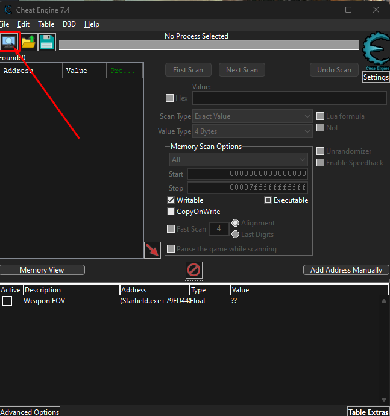
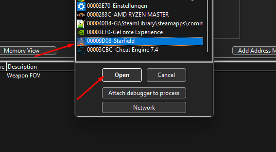
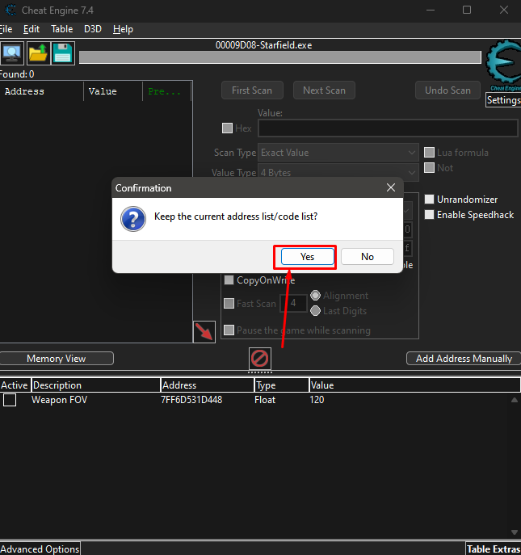
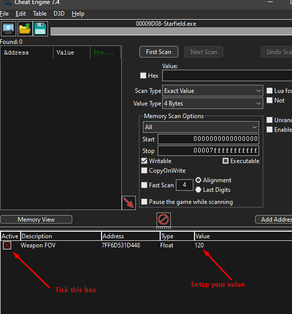

# Starfield-WeaponFoV-CheatEngine

**This is for people who want a different World and Viewmodel FoV.**

At the moment Starfield generates its Viewmodel FoV based on the setted up World FoV as soon as you talk to an NPC and start a dialog.

For 21:9 or 32:9 users however, a higher Viewmodel FoV is needed in comparison to the world FoV to achieve the same sort of weapon visibility like when playing with 16:9.
Also some people might want to have a higher Viewmodel value in general without touching the World FoV at all.

*As of now, there is no direct console command or ini setting available to set up the Viewmodel FoV.*

---

Direct Download Links:

[STEAM BUILD 12051365](https://github.com/Tautellini/Starfield-WeaponFoV-CheatEngine/archive/refs/tags/0.1.zip) (Early Access Pre-Release Build)

---

## How to use:

### 1. Install Cheat Engine.

### 2. Open the file "StarfieldWeaponFOV.CT".

### 3. Then click on the top left Icon to attach it to the Starfield Process.

### 3 - Select "Keep current address list" when attaching the script to the game.

### 4 - When it is attached, select your value and tick the address active.

